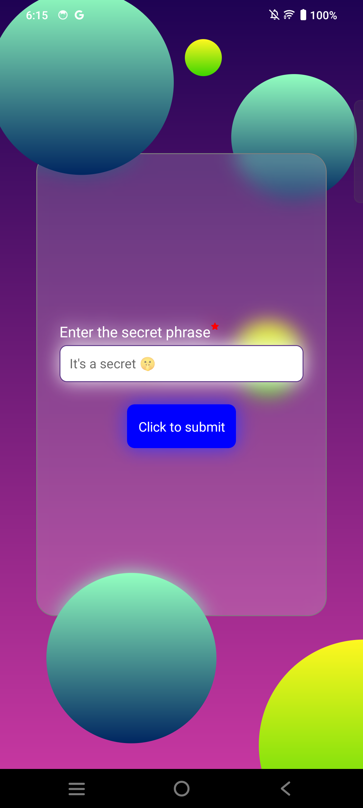

# React Native Reanimated Sign-In

Welcome to the React Native Reanimated Sign-In project! This project showcases the implementation of a sign-in screen with smooth animations and interactive elements using React Native Expo and React Native Reanimated.

## Features

- Smooth animations powered by React Native Reanimated.
- Interactive sign-in screen with input fields and buttons.
- Seamless user experience designed with React Native Expo.

## Getting Started

To get started with this project, follow these steps:

1. Clone this repository to your local machine:

```bash
git clone https://github.com/Mohammed-Yasin-Mulla/rn-reanimated-sign-in.git
```


2. Navigate to the project directory:

```bash
cd rn-reanimated-sign-in
```

3. Install dependencies:


```bash
npm install
```


4. Start the Expo development server:

```bash
npm start
```


5. Open the Expo Go app on your mobile device and scan the QR code from the Expo developer tools in your browser to view the app.

## Preview

<!-- [Insert Screenshots or GIFs of the App] -->

[](https://youtube.com/shorts/tx6QDftLt2I)


## Contributing

Contributions are welcome! If you have any ideas for improvements or new features, feel free to open an issue or submit a pull request.

## License

This project is licensed under the MIT License.

## Contact

For any inquiries or feedback, please contact [Email](yasinspy1999@gmail.com).
